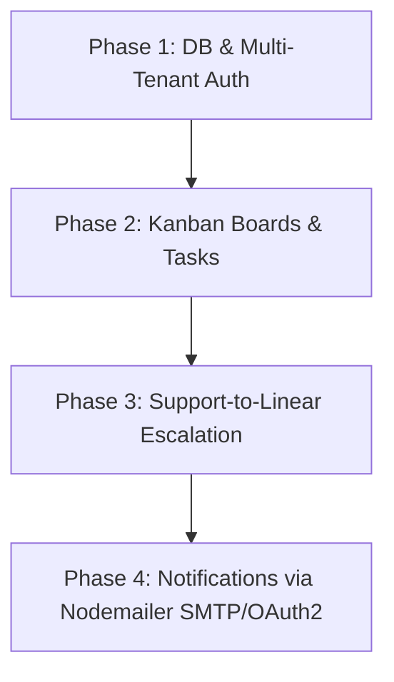

# Integration Plan: Helpdesk + Linear-Like Project Management

This document details how we will integrate the Linear-like project management features defined in the PRD into our existing Helpdesk application. We will preserve the existing Tech Stack (React + Vite + Express + Prisma + Better Auth + pg-boss + NVIDIA AI SDK) and monorepo structure.

---

## 1. Unified PRD (Product Requirements Document)

### Vision
A unified Customer Support & Product Engineering platform. Support agents can receive tickets, classify them via AI, and escalate complex bugs or feature requests directly to engineering Kanban boards as tasks. When engineering finishes a task on the board, the customer support ticket is automatically updated or resolved.

### Core Features
1. **Multi-Tenant Workspaces**:
   - Users belong to workspaces (organizations).
   - All tickets and task boards are scoped to a workspace.
   - **Onboarding**: A new user signup forces the user to either create a new workspace (becoming the Owner) or join an existing one via invite.

2. **Teams & User Management**:
   - Workspaces have multiple teams (e.g., Engineering, Support, QA).
   - Workspace admins can invite, edit, or remove users.
   - Users can be assigned to tasks and tickets within their workspace.

3. **Kanban Boards & Drag-and-Drop**:
   - Each workspace/team has Task Boards.
   - Boards contain customizable columns (e.g., Backlog, Todo, In Progress, Review, Done).
   - High-fidelity drag-and-drop interface for moving tasks across lanes.

4. **Helpdesk to Linear Escalation (Unified Workflow)**:
   - Escalation button on tickets to "Create linked Task".
   - AI automatically extracts ticket body, drafts the task title, description, recommends priority, and assigns the task to the right team.
   - Automatic sync: If a linked task is moved to "Done", the system enqueues a background job to update the ticket status and draft an automated resolution email.

5. **Notification System (Nodemailer SMTP/OAuth2)**:
   - Outbound welcome emails on workspace onboarding.
   - Transactional emails for task assignment, ticket escalation, and alerts.

---

## 2. TRD (Technical Requirements Document)

### Database Schema Updates (`schema.prisma`)

We will update `server/prisma/schema.prisma` to add workspaces, teams, boards, columns, tasks, and subscription fields:

```prisma
enum WorkspaceRole {
  owner
  admin
  member
}

enum TaskPriority {
  no_priority
  low
  medium
  high
  urgent
}

model Workspace {
  id                    String            @id @default(uuid())
  name                  String
  slug                  String            @unique
  ownerId               String
  createdAt             DateTime          @default(now())
  updatedAt             DateTime          @updatedAt
  members               WorkspaceMember[]
  teams                 Team[]
  boards                Board[]
  tickets               Ticket[]
  tasks                 Task[]

  @@map("workspace")
}

model WorkspaceMember {
  id          String        @id @default(uuid())
  workspaceId String
  workspace   Workspace     @relation(fields: [workspaceId], references: [id], onDelete: Cascade)
  userId      String
  user        User          @relation(fields: [userId], references: [id], onDelete: Cascade)
  role        WorkspaceRole @default(member)
  createdAt   DateTime      @default(now())

  @@unique([workspaceId, userId])
  @@map("workspace_member")
}

model Team {
  id          String    @id @default(uuid())
  name        String
  workspaceId String
  workspace   Workspace @relation(fields: [workspaceId], references: [id], onDelete: Cascade)
  members     User[]    @relation("TeamMembers")
  tasks       Task[]
  createdAt   DateTime  @default(now())
  updatedAt   DateTime  @updatedAt

  @@map("team")
}

model Board {
  id          String        @id @default(uuid())
  name        String
  workspaceId String
  workspace   Workspace     @relation(fields: [workspaceId], references: [id], onDelete: Cascade)
  columns     BoardColumn[]
  tasks       Task[]
  createdAt   DateTime      @default(now())
  updatedAt   DateTime      @updatedAt

  @@map("board")
}

model BoardColumn {
  id        String   @id @default(uuid())
  name      String
  position  Int      // Order position on the board
  boardId   String
  board     Board    @relation(fields: [boardId], references: [id], onDelete: Cascade)
  tasks     Task[]
  createdAt DateTime @default(now())
  updatedAt DateTime @updatedAt

  @@map("board_column")
}

model Task {
  id            String       @id @default(uuid())
  taskKey       String       // e.g., ENG-101
  title         String
  description   String
  priority      TaskPriority @default(no_priority)
  position      Int          // Order inside the column for drag/drop
  workspaceId   String
  workspace     Workspace    @relation(fields: [workspaceId], references: [id], onDelete: Cascade)
  teamId        String?
  team          Team?        @relation(fields: [teamId], references: [id])
  boardId       String?
  board         Board?       @relation(fields: [boardId], references: [id])
  boardColumnId String?
  boardColumn   BoardColumn? @relation(fields: [boardColumnId], references: [id])
  assigneeId    String?
  assignee      User?        @relation("TaskAssignee", fields: [assigneeId], references: [id])
  creatorId     String
  creator       User         @relation("TaskCreator", fields: [creatorId], references: [id])
  linkedTicketId Int?        @unique
  linkedTicket   Ticket?     @relation(fields: [linkedTicketId], references: [id])
  createdAt     DateTime     @default(now())
  updatedAt     DateTime     @updatedAt

  @@unique([workspaceId, taskKey])
  @@map("task")
}
```

*Note: Update existing relations in `User` and `Ticket` models to refer to workspaces and tasks.*

---

### API Endpoint Architecture

All new routes will be located under `server/src/routes/` and mounted in `index.ts`:

#### 1. Workspaces (`/api/workspaces`)
* `POST /` - Create workspace & trigger admin member setup.
* `GET /current` - Retrieve active workspace context.
* `POST /invite` - Send invitation via Nodemailer SMTP/OAuth2.
* `GET /members` - List workspace members.

#### 2. Kanban Boards (`/api/boards`)
* `GET /` - List all boards in workspace.
* `POST /` - Create a board (initializes defaults: Backlog, Todo, In Progress, Review, Done).
* `GET /:id` - Fetch board columns and tasks.
* `PUT /tasks/move` - Update task position and boardColumnId (optimized for quick drag-drop).

#### 3. Tasks (`/api/tasks`)
* `POST /` - Create a new task.
* `PUT /:id` - Update task details (assignee, priority, team, status).
* `POST /escalate` - Create a task linked to a ticket (uses NVIDIA AI to auto-generate content).

---

### Frontend Pages & Components (`client/src`)

We will add the following pages:
1. `/workspaces/onboarding` - Interactive workspace creation wizard.
2. `/boards` - Boards selector and overview page.
3. `/boards/:id` - Kanban board route using `@hello-pangea/dnd` for smooth card animations.

---

## 3. Phased Implementation Milestones



### Phase 1: DB & Multi-Tenant Authentication
* **Database**: Update Prisma schema, run migrations, and update seed files.
* **Backend**:
  * Adjust `requireAuth` middleware to check and load workspace contexts.
  * Register Workspace route router.
* **Frontend**:
  * Add Onboarding screen for new signups to configure their team/workspace.
  * Add Workspace switcher in layout header.

### Phase 2: Kanban Boards & Tasks
* **Backend**:
  * Build endpoints for listing boards, columns, and tasks.
  * Write high-performance status-move transaction logic to handle drag-drop ordering.
* **Frontend**:
  * Implement Board views.
  * Build drag-and-drop lanes using `@hello-pangea/dnd` or `@dnd-kit`.
  * Add dialogs to create/edit tasks, assign members, and set priorities.

### Phase 3: Helpdesk-to-Linear Escalation (AI Integration)
* **Backend**:
  * Create a new endpoint `POST /api/tasks/escalate` that accepts `ticketId`.
  * Send ticket body to Nvidia AI API to generate structured title, description, team category, and priority.
  * Create the linked task in database.
  * Listen for task changes: when task is moved to `Done` column, schedule a `pg-boss` background job to auto-resolve the linked support ticket.
* **Frontend**:
  * Add "Escalate to Task" button in `TicketDetailPage`.
  * Display linked task statuses directly inside ticket detail metadata.

### Phase 4: Nodemailer SMTP/OAuth2 Email Integration
* **Service Setup**: Re-use the existing Nodemailer utility (configured with Gmail OAuth2 / SMTP credentials in `.env`).
* **Outbound Events**:
  * Trigger transactional emails for task assignees.
  * Send welcome email template on workspace onboarding.
  * Notify agents when linked task changes.

---

## 4. Instructions for AI Agent Implementation

When implementing these phases, strictly follow these instructions to remain consistent with the workspace conventions:

### Shared Validation and Types
* Always define schema validations (like Workspace creation or Task modifications) inside `core/schemas/` (e.g. `core/schemas/tasks.ts`).
* Import validators using `validate` helper inside express controllers.
* Export TypeScript types from `core/` to prevent duplicate type declarations between client and server.

### State Management
* Avoid native React `useState`/`useEffect` for fetching API data. Use TanStack React Query mutations (`useMutation`) and queries (`useQuery`).
* On drag-and-drop completion, use optimistic updates in React Query's `onMutate` handler to make board movement feel instantaneous.

### Styling & Aesthetics
* Build board UI components strictly with `shadcn/ui` imports (e.g., card, dialog, badge, select).
* Keep styling premium: use smooth transitions on column hovers, clean status badges, and subtle indicator colors for card priorities (high priority = crimson background badge, urgent = pulsing danger border).
* Maintain standard layouts using the theme context provider.