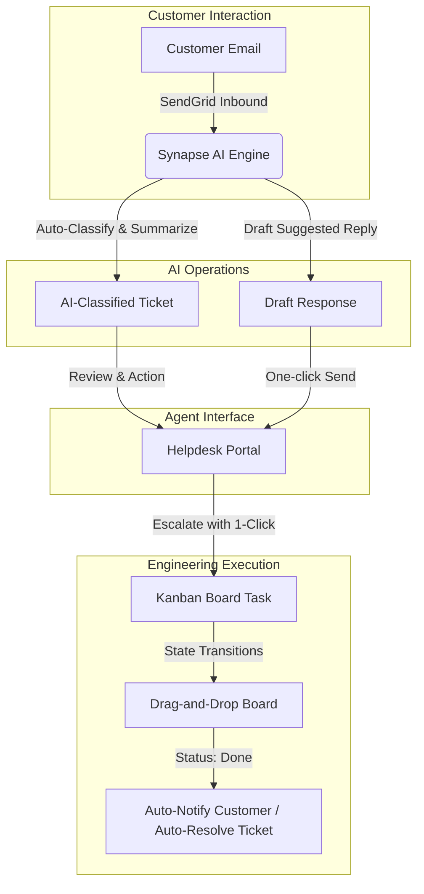
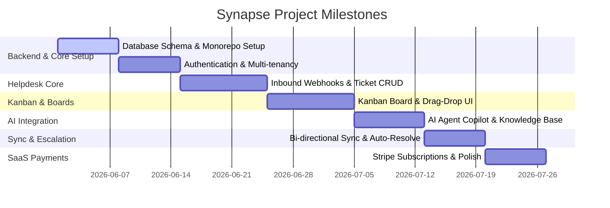

# PRODUCT REQUIREMENT DOCUMENT (PRD)

## Synapse: Unified AI Helpdesk & Kanban Task Management Platform

| Document Details | Information |
| :--- | :--- |
| **Product Name** | **Synapse** |
| **Document Version** | v1.0 |
| **Status** | Draft (Ready for Review) |
| **Target Launch Date** | Q3 2026 |
| **Author** | Product Management Team |

---

## 1. Executive Summary & Vision

### 1.1 Product Vision
**Synapse** is a unified, enterprise-grade operations platform that bridges the gap between customer support (Helpdesk) and engineering/product execution (Task Management). 

Traditionally, support teams and development teams operate in silos, using disparate tools (e.g., Zendesk and Linear). This friction leads to delayed resolutions, lost context, and manual duplicate entry. 

Synapse solves this by providing a single, seamless experience. It ingests customer inquiries, uses advanced AI to classify and draft resolutions, and allows support agents to instantly escalate issues into high-performance Kanban-based engineering tasks—keeping customers, agents, and developers perfectly aligned in real-time.



---

## 2. Problem Statement & Opportunity

### 2.1 The Problem
* **Operational Disconnect:** Support agents manually relay bugs to engineering via Slack, Jira, or email, losing critical customer context (e.g., steps to reproduce, user metadata).
* **High Support Overhead:** Agents spend hours reading, classifying, summarizing, and writing repetitive responses to hundreds of inbound support emails.
* **Lack of Visibility:** Customers and support agents are left in the dark about when a bug fix or feature request is actually going to be deployed.
* **Fragmented Tooling Costs:** Organizations pay high, separate licensing fees for support helpdesks, task managers, AI summarizers, and communication channels.

### 2.2 The Solution
* **Integrated Workspace:** A single ecosystem combining a multi-tenant helpdesk with a fast, modern, keyboard-shortcut-friendly Kanban task board.
* **AI-First Workflows:** Out-of-the-box email intake with automated AI ticket classification, instant executive summaries, and context-aware drafted responses based on a system-wide knowledge base.
* **Bi-directional Escalation:** Convert any support ticket into a Kanban issue with a single click. Status changes on the developer's Kanban board automatically sync back to update the support ticket and draft customer notifications.
* **SaaS Billing:** Native monetization architecture with tiered subscriptions (Lite vs. Pro) managed by Stripe, enabling seamless monetization.

---

## 3. User Personas & Roles

| Role | Core Objectives | Pain Points | System Permissions |
| :--- | :--- | :--- | :--- |
| **System Admin** | System setup, team onboarding, subscription management. | High maintenance overhead, configuring complex integrations. | Access to billing, team invite settings, user management, and workspace global configurations. |
| **Support Agent** | Resolving customer tickets quickly and maintaining high customer satisfaction (CSAT). | Ticket overload, slow developer response, repetitive typing, and manual categorization. | Complete ticket management, access to the ticket list/detail pages, viewing AI suggested replies, and escalating tickets to tasks. |
| **Developer / Contributor** | Fixing bugs and building features assigned to them. | Interrupted by ad-hoc support requests, lack of context on reported issues, and cluttered tools. | Complete access to Kanban boards, backlog management, and issue updating. No direct customer support response access. |
| **End Customer** | Getting fast, high-quality, and accurate responses to inquiries. | Long waiting times, canned/impersonal responses, and no updates on bug statuses. | Interact solely via email (no platform login required). |

---

## 4. Key Product Pillars & Functional Specifications

### 4.1 Pillar 1: AI-Powered Support Helpdesk

#### Inbound Email Ingestion & Parsing
* **Requirements:**
  * Support emails sent to `support@yourdomain.com` must be ingested dynamically (via SendGrid Inbound Parse or similar webhook).
  * Auto-extract sender information, email body, attachments, and email headers to maintain high-fidelity threads.
  * Correctly thread replies back to the original ticket by analyzing email headers (In-Reply-To, References).

#### AI Agent Copilot (Powered by AI SDK)
* **Requirements:**
  * **Auto-Classification:** On ingest, the AI engine classifies the ticket into categories (e.g., *General Question*, *Technical Question*, *Refund Request* or custom tags) and sets priority.
  * **Ticket Summarization:** Display an instant 2-3 sentence summary at the top of the ticket detail view, allowing agents to understand complex, multi-email issues in seconds.
  * **Knowledge Base Ingestion:** System administrators can maintain a Knowledge Base (KB). The AI reads this KB to generate highly accurate draft replies.
  * **Suggested Replies:** Provide pre-drafted, human-friendly email replies for agents to review, edit, and send with one click.

> [!NOTE]
> AI features utilize a localized prompt engineering strategy leveraging a system-provided Knowledge Base to prevent hallucinations regarding pricing, policies, or technical procedures.

---

### 4.2 Pillar 2: Integrated Kanban Task Manager (Linear-like)

#### Workspace & Team Onboarding
* **Requirements:**
  * Clean, frictionless user onboarding where team managers can create a new Workspace and invite members.
  * Keyboard-centric UI with modern, aesthetic, and lightning-fast layouts.

#### Interactive Kanban Boards
* **Requirements:**
  * Support multiple columns representing workflow stages: `Backlog`, `Todo`, `In Progress`, `Done`, and `Canceled`.
  * Fully interactive fluid drag-and-drop mechanics to transition tasks between states.
  * Customizable filters by assignee, priority (Low, Medium, High, Urgent), and labels.
  * Dark mode by default with a clean, smooth light-mode toggle.

```
+---------------------------------------------------------------------------------+
|  [Search Issues...]           Synapse Workspace           (O) Support  [#] Board|
+---------------------------------------------------------------------------------+
|  TODO (2)               IN PROGRESS (1)             DONE (12)                   |
|  +-------------------+  +-------------------+  +-------------------+            |
|  | #SYN-45: Fix Auth |  | #SYN-32: Refund   |  | #SYN-12: Welcome  |            |
|  | Priority: [High]  |  | Priority: [Urgent]|  | Priority: [Low]   |            |
|  | Assignee: Kalash  |  | Assignee: Kalash  |  | Assignee: Kalash  |            |
|  +-------------------+  +-------------------+  +-------------------+            |
|  +-------------------+                                                          |
|  | #SYN-46: Seed db  |                                                          |
|  | Priority: [Med]   |                                                          |
|  | Assignee: Kalash  |                                                          |
|  +-------------------+                                                          |
+---------------------------------------------------------------------------------+
```

---

### 4.3 Pillar 3: Unified Ticket-to-Task Escalation Sync

This represents the primary value proposition of Synapse: bridging helpdesk operations with developer workflows.

```
       SUPPORT AGENT SIDE                       DEVELOPER KANBAN BOARD
+------------------------------+             +------------------------------+
| Support Ticket #1084         |             | Kanban Issue #SYN-112        |
| Category: Technical Question |             | Title: Stripe checkout crash |
|                              |             | Status: IN PROGRESS          |
| [ Escalate to Kanban Task ] -+------------>| Related Ticket: #1084 (Linked|
|                              |             |                              |
| Status: ESCALATED            |             | [Move to DONE]               |
+------------------------------+             +------------------------------+
               |                                            |
               +<----------------- AUTO-SYNC ---------------+
               |
               v
  (Automatic State Change)
  - Ticket Status -> RESOLVED
  - AI Drafts email: "We've resolved this bug! Let us know if..."
```

* **Requirements:**
  * **One-Click Promotion:** Within the Ticket Detail View, an agent can click "Convert to Task". This opens a modal to select a board, set priority, assign a developer, and auto-populate the description with the AI-generated ticket summary.
  * **Bi-directional Linking:** The support ticket displays a widget showing the linked Kanban task ID and its live status (e.g., `In Progress`). The Kanban task displays a link pointing back to the customer's support thread for developer context.
  * **Auto-Resolution Webhook:** When a developer moves a linked task to the `Done` column:
    * The support ticket status automatically transitions to `Resolved`.
    * The AI engine instantly drafts a customized notification email to the customer: *"Our engineering team has resolved the issue regarding [Summary]! The fix is now live..."*
    * The support agent receives a notification to review and send the drafted response.

---

### 4.4 Pillar 4: Billing, Payments & Subscriptions

To facilitate immediate commercialization, Synapse includes a robust billing and subscription model.

* **Requirements:**
  * **Multi-Tenant Stripe Integration:** Subscription billing integrated directly into the workspace settings.
  * **Tiered Access:**
    * **Lite Tier (Base):** Limited active tickets per month, up to 3 workspace members, and basic AI features (ticket classification).
    * **Pro Tier (Premium):** Unlimited active tickets, unlimited workspace members, advanced AI suggested replies, auto-sync escalation, and custom domain email hosting.
  * **Frictionless Portals:** Integration with Stripe Customer Portal, allowing users to update payment methods, download invoices, and upgrade/downgrade subscription tiers dynamically.

---

## 5. Technology Stack

Synapse utilizes a unified, cutting-edge technology stack designed to support fast development, sub-second client response times, and high scalability:

* **Frontend:**
  * **Framework:** React 19 / Next.js 16 (App Router with optimized data loading via `proxy.ts` / server actions).
  * **Styling:** Vanilla CSS & Tailwind CSS for layouts; premium custom HSL palettes ensuring rich, cohesive visuals.
  * **UI Components:** Shadcn/ui (radix primitives) optimized for smooth animations, micro-interactions, and accessibility.
  * **State & Data Fetching:** TanStack Query (React Query) for rapid UI data synchronization and robust caching.

* **Backend & Database:**
  * **Runtime:** Bun (lightning-fast JS engine, built-in test runners, and dependency management).
  * **Framework:** Express 5 / Next.js API Routes ensuring a high-throughput, low-latency API surface.
  * **Database:** PostgreSQL (highly-optimized relational structure).
  * **ORM:** Prisma ORM for type-safe schema declarations and database migrations.
  * **Authentication:** Better Auth (supporting secure email/password auth, social logins, database-backed sessions, and workspace-level multi-tenancy).

* **AI & Job Queue:**
  * **AI Integration:** OpenAI GPT & Anthropic Claude APIs consumed via the unified **Vercel AI SDK**.
  * **Job Queue:** `pg-boss` (Postgres-based queue) to handle background tasks such as email ingestion parsing, outbound email scheduling, and AI queue processing without blocking primary user interactions.

* **Email & Integrations:**
  * **Ingest/Outbox:** SendGrid / Resend webhook systems for transactional welcome emails, password resets, and bidirectional support threads.

---

## 6. Implementation Milestone Plan

The implementation is broken down into structured, logical milestones to minimize risk and deliver value early.



### Milestone 1: Platform Foundation & Authentication (Days 1–14)
* **Goal:** Set up a secure multi-tenant codebase.
* **Deliverables:**
  * Monorepo setup with shared schemas (`/core`), frontend (`/client`), and backend API (`/server`).
  * Database initialization (Prisma migrations, PostgreSQL docker configuration).
  * Better Auth integration supporting workspace creation, secure logins, and role-based permissions (Admins, Agents, Developers).

### Milestone 2: Helpdesk Core & Ticket Operations (Days 15–24)
* **Goal:** Enable active support agents to receive, track, and manage incoming tickets.
* **Deliverables:**
  * SendGrid inbound parse webhook setup to ingest support emails dynamically.
  * Ticket list and filter/sort dashboard (Filter by: Status, Category, Date, Agent).
  * Ticket Detail Thread View allowing agents to read full threads, type replies, and send outbound emails.

### Milestone 3: Kanban Board & Workspace Tasks (Days 25–34)
* **Goal:** Deliver a beautiful, mouse-free, highly responsive Kanban interface.
* **Deliverables:**
  * Workspace Board view displaying columns (`Todo`, `In Progress`, `Done`, etc.).
  * Fluid drag-and-drop card transitions using modern web APIs.
  * Issue creation, prioritization, labeling, and developer assignment forms.

### Milestone 4: AI Copilot & Knowledge Engine (Days 35–42)
* **Goal:** Supercharge agent response rates using Vercel AI SDK.
* **Deliverables:**
  * Automated ticket classification and summarization models on ingest.
  * Custom admin panel to feed knowledge base documentation (text and Markdown uploads).
  * Dynamic suggested-reply box integrated into the ticket details window.

### Milestone 5: Bi-directional Synchronization (Days 43–49)
* **Goal:** Connect support tickets directly with developer tasks.
* **Deliverables:**
  * Support UI action to promote a ticket directly to a Kanban issue.
  * Background synchronization engine linking Ticket state with Task state.
  * Auto-resolve webhook triggering email drafting when a developer finishes a task.

### Milestone 6: Stripe Monetization & Launch Prep (Days 50–56)
* **Goal:** Ready the product for production scaling and revenue capture.
* **Deliverables:**
  * Stripe subscriptions webhooks and checkout flows integrated (Lite vs. Pro tiers).
  * Comprehensive input validation, security rate-limiting, and error tracking via Sentry.
  * Dockerization (Dockerfile setup) for unified single-service deployments on cloud infrastructure (Railway/AWS).

---

## 7. Success Metrics & Key Performance Indicators (KPIs)

To evaluate the success of Synapse post-launch, we will monitor these key metrics:

* **Support Efficiency:**
  * **First Response Time (FRT):** Target a 75% reduction in first response times using AI suggested drafts.
  * **Ticket Resolution Time:** Average time elapsed between ticket creation and agent resolution. Target under 4 hours for technical issues by leveraging direct Kanban escalation.
  * **AI Draft Acceptance Rate:** The percentage of pre-drafted AI responses sent by agents with minimal or no edits. Target: >60%.

* **Productivity & Sync:**
  * **Escalation Friction:** Number of tickets promoted to developer boards.
  * **Developer Context Accuracy:** Tracking the reduction of developer back-and-forth questions due to customer email context automatically pre-populating Kanban tasks.

* **SaaS Health:**
  * **Workspace Conversion Rate:** The percentage of newly created workspaces upgrading from Lite to Pro within the first 30 days.
  * **Churn Rate:** Monthly active workspace churn rate. Target: <3% per month.
